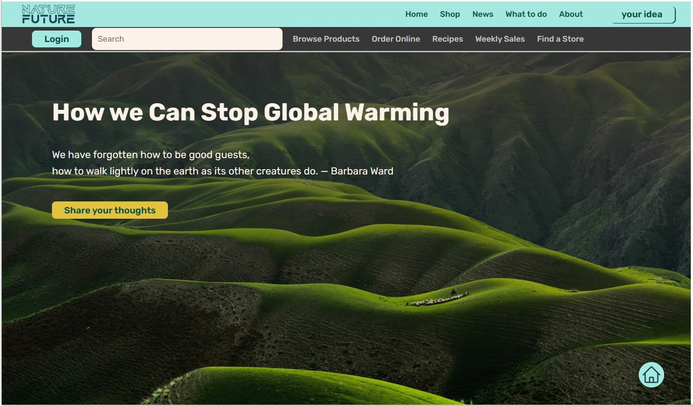
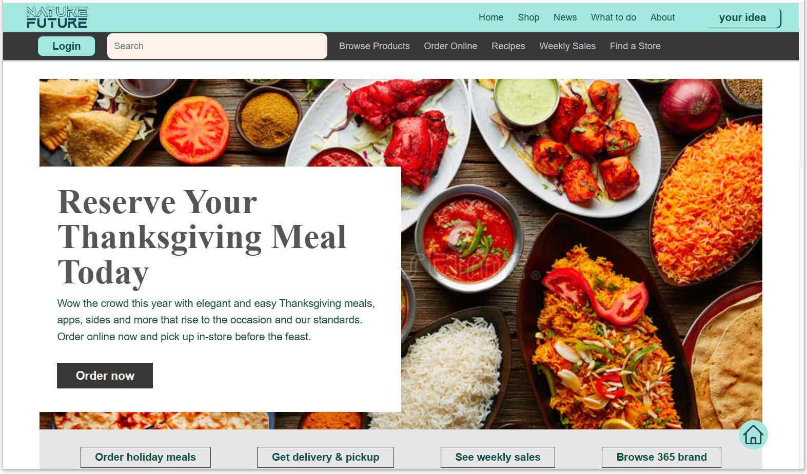
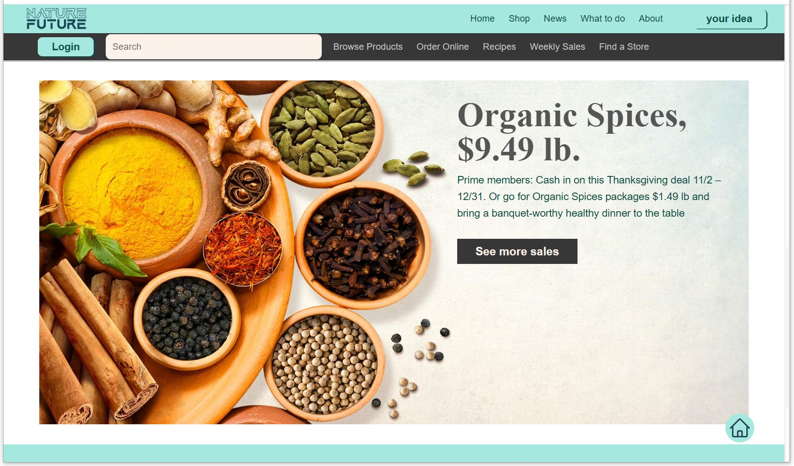
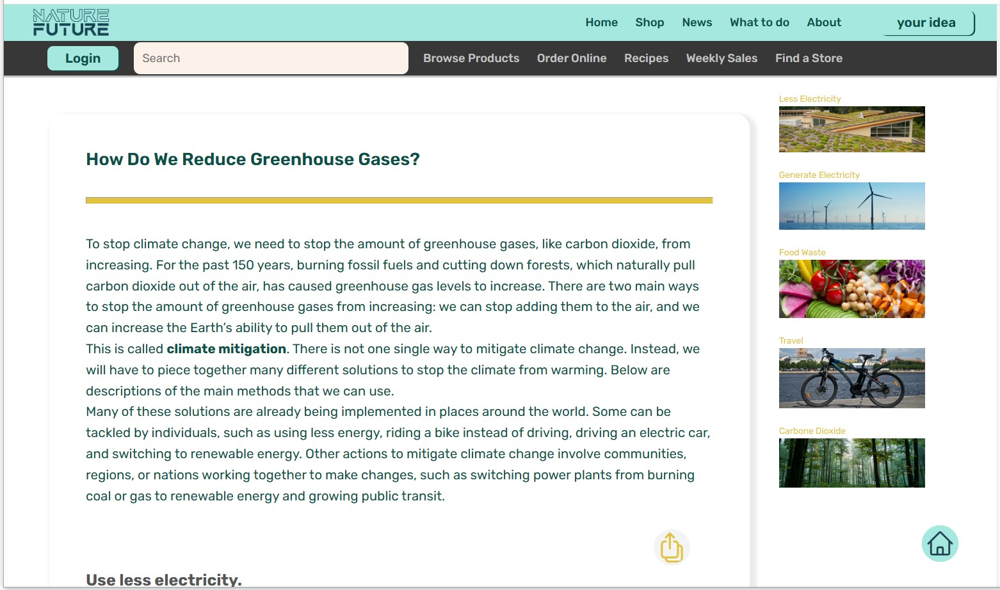
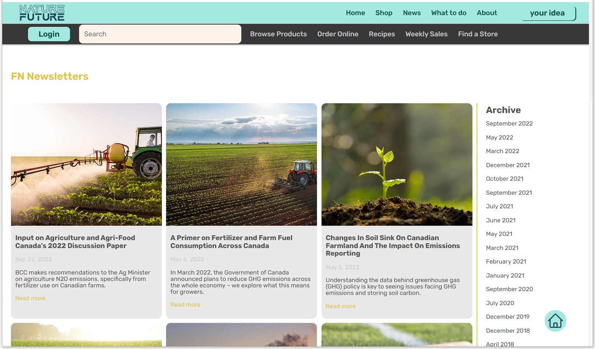
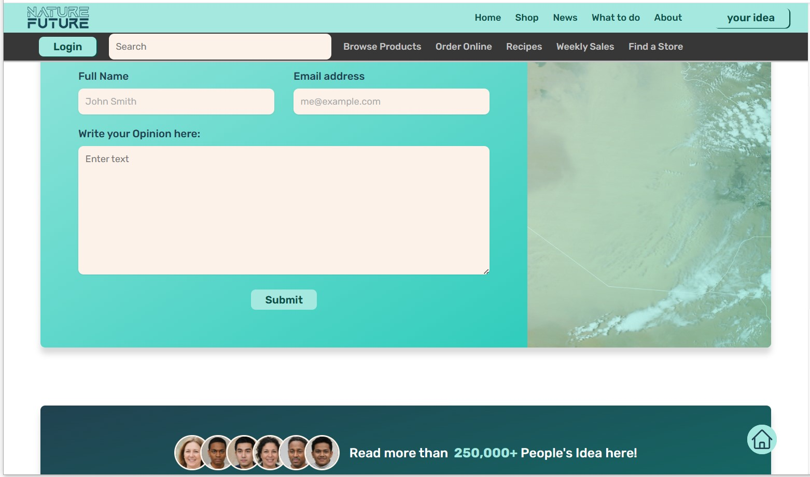

# My First HTML & CSS Project

## Project Overview

This is my very first project where I practiced using HTML and CSS to create a basic web page. The project is designed to help me understand the fundamentals of web development, including structuring content with HTML and styling it with CSS.

## Live Demo

You can view the live version of the project here: [Live Demo on Netlify](https://fateme-future-nature.netlify.app)

## Features

- **Simple Layout**: The web page is structured with sections like header, main content, and footer.
- **Responsive Design**: The page adjusts its layout when viewed on devices of various screen sizes.
- **Styled Components**: Various HTML elements like buttons, links, and text are styled using CSS to improve visual appearance.

## Technologies Used

- **HTML**: For structuring the content of the web page.
- **CSS**: For styling the content and adding layouts, colors, and fonts.

## How to View the Project Locally

1. **Clone the repository**:
   ```bash
   git clone https://github.com/FatemeBagherzad/Future-Nature.git
   ```
2. Navigate into the project directory:
   ```bash
   cd Future-Nature
   ```
3. Open the `index.html` file in your preferred web browser.

## Screenshot

Here is some preview of the website:








## What I Learned

- How to structure a basic webpage using semantic HTML elements.
- How to apply CSS styles to enhance the appearance of a webpage.
- The importance of creating a responsive layout.

## Future Improvements

- Add interactivity using JavaScript.
- Implement a more complex layout with additional sections.
- Improve accessibility for users with disabilities.

## Contributing

If you have suggestions or improvements for this project, feel free to create an issue or submit a pull request.

## Contact

- **Email**: fa.bagherzad@gmail.com
- **GitHub**: [Fateme Bagherzad](https://github.com/FatemeBagherzad)
- **Linkedin**: [Fateme Bagherzad](https://www.linkedin.com/in/fatemeh-bagherzad/)
